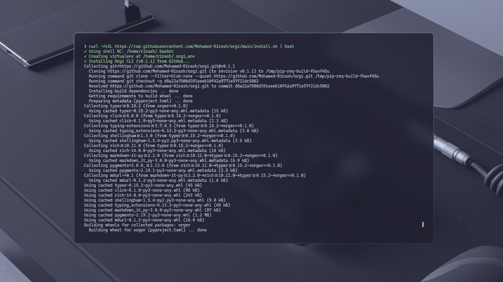
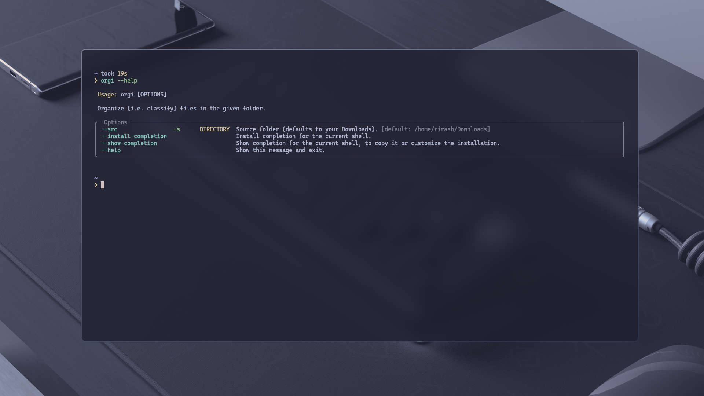

# Orgi CLI


A powerful and intuitive command‑line utility for automatically sorting and organizing files in your Downloads (or any specified) directory into date‑based folders and type‑based categories.

<p align="center">
  
</p>

---

## Table of Contents

1. [Features](#features)
2. [Installation](#installation)
3. [Usage](#usage)
4. [Configuration](#configuration)
5. [Examples](#examples)
6. [Uninstallation](#uninstallation)
7. [Contributing](#contributing)
8. [License](#license)
9. [Support](#support)

---

## Features

- **Custom Source Directory:** Defaults to `~/Downloads`; override via `--src <path>`.
- **Date‑Based Organization:** Creates subdirectories named `YYYY-MM-DD`.
- **Type‑Based Categories:** Automatically sorts into:
  - `images/` (e.g. `.png`, `.jpg`, `.gif`)
  - `videos/` (e.g. `.mp4`, `.mkv`)
  - `documents/` (e.g. `.pdf`, `.docx`, `.txt`)
  - `music/` (e.g. `.mp3`, `.wav`)
  - `others/` for uncategorized files.
- **Cross‑Platform:** Compatible with Linux and macOS (Windows support forthcoming).
- **Lightweight:** Minimal dependencies; easy to install and run.

---

## Installation

### Via Curl Installer (Recommended)

```bash
curl -fsSL https://raw.githubusercontent.com/Mohamed-Rirash/orgi/main/install.sh | bash
```



### From Source

```bash
git clone https://github.com/Mohamed-Rirash/orgi.git
cd orgi
python3 -m pip install .
```

---

## Usage

Run the organizer on your default Downloads folder:

```bash
orgi 
```

Specify a custom source directory:

```bash
orgi auto --src /path/to/folder
```


View all available commands and options:

```bash
orgi --help
```


---

## Configuration

Create an optional config file at `~/.orgirc`:

```ini
[src]
path = /Users/you/Downloads

[categories]
images    = .png,.jpg,.jpeg,.gif
videos    = .mp4,.avi,.mkv
documents = .pdf,.docx,.txt
music     = .mp3,.wav
others    =
```

Load a custom config:

```bash
orgi auto --config /path/to/.orgirc
```

---

## Examples

Organize a demo directory:

```bash
orgi auto --src ./demo_downloads
```

---

## Uninstallation

To remove Orgi completely:

```bash
curl -fsSL https://raw.githubusercontent.com/Mohamed-Rirash/orgi/main/uninstall.sh | bash
```

---

## Contributing

Contributions are welcome! Please:

- Open issues for bugs or feature requests.
- Fork the repository and submit pull requests.
- Follow our [Code of Conduct](CODE_OF_CONDUCT.md).
- Review our [Contribution Guidelines](CONTRIBUTING.md).

---

## License

Distributed under the MIT License. See [LICENSE](LICENSE) for details.

---

## Support

If you find Orgi helpful, please:

- 🌟 Star the repository.
- 🔄 Share with friends and colleagues.
- ❤️ Contribute to the project.

Happy organizing! 📁✨
